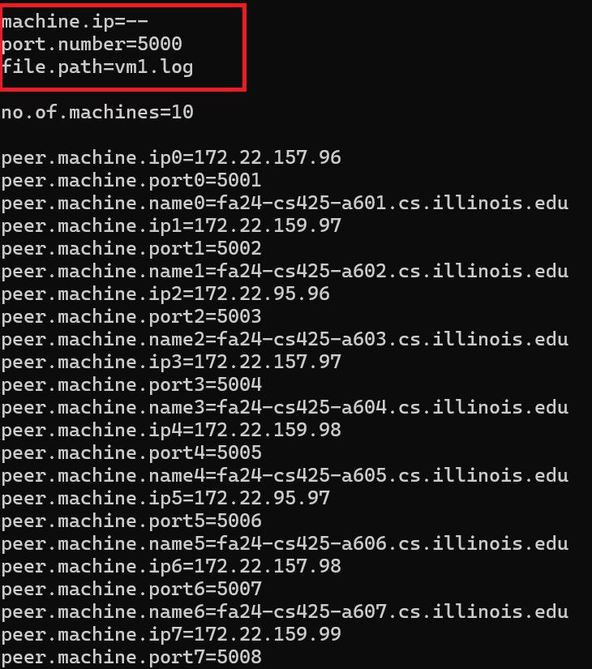
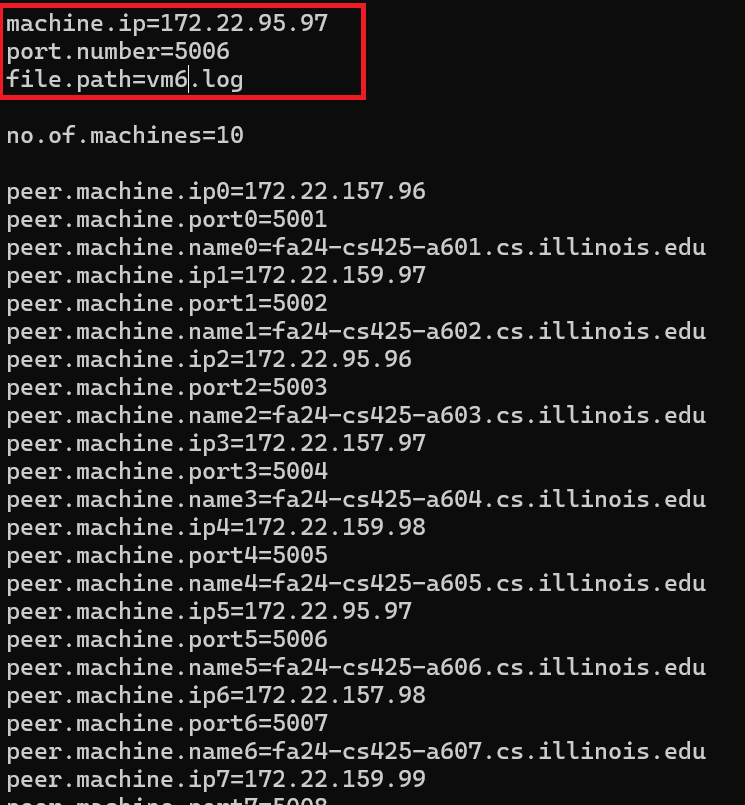

# CS 425 MP1 (Distributed Log Querier)

## Description
The Distributed Log Querier/Grep is a system comprising two distinct processes: the server process and the client process. 
The program is written in Java and uses socket programming to establish communication between the client and the server.
On the client side, commands are passed with command-line parameters, initiating multiple threads to send commands to each target machine.
These threads connect to the respective servers, which are continuously running in the background, awaiting connections. Upon receiving a connection, 
the server processes the command using a Command Processor, executes it via a Grep Executor, and returns the results to the client. 
The client then prints the number of lines and saves the output to a file. All threads on the client machine operate concurrently to 
manage command execution across different machines. After receiving and printing the results from all machines, the client terminates.

## Installation Instructions

###  Running Server
1) SSH into all 10 VMs.


2) Clone the Git repository:
```
git clone https://gitlab.engr.illinois.edu/sdare1/CS-425-MP1-Socket.git
```

3) After cloning is completed, open application.properties using:
```
nano application.properties
```


Edit the properties file to set up the respective IP, port number, and file path. 

(for vmN use information from peer.machine.ipN-1 (for vm06 use peer.machine.ip5))

(A sample for vm06 is provided below.)


*Image 1: Application Properties Before edit for vm06.*



*Image 2: Application Properties After edit for vm06.*



4) After editing & saving the application.properties, build the project using:
```
mvn clean install
```

5) After building, move the JAR file one level up:
```
cd target/
mv mp1-1.jar ../
```
6) Move the log files from your local machine to the VMs (Sample command):

```
scp {log file Name}.log netid@{VM ip}:{Path to the git repository}
```

7) Run the server using:

```
java -jar mp1-1.jar Server
```

###  Running Client

1. SSH into the machine on which you want to run the client.

2. Go to the repository folder and run the client using the following command (mention the grep command):

```
java -jar mp1-1.jar Client "grep -n \"GET\""
```


